# 关于linux的虚拟机安装（以virtualbox安装ubuntu为例）

类unix系统的渗透环境配置会比windows要方便不少，特别是docker的出现，使得环境配置更加简单。

主要有wsl、vm、裸机安装三种方式，这里介绍门槛比较低的vm方式

## 1.下载安装virtualbox
1. [下载地址](https://download.virtualbox.org/virtualbox/)
2. 安装virtualbox

## 2.下载ubuntu镜像

安利一下JLU的LUG最近搭建的镜像站，校内速度很快QwQ

[镜像站](https://mirrors.jlu.edu.cn/)

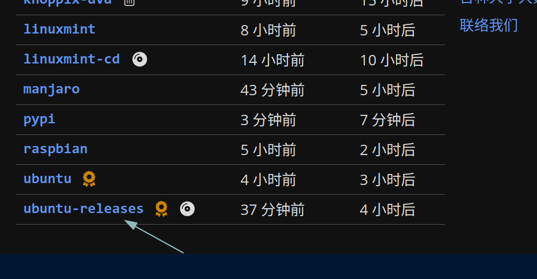

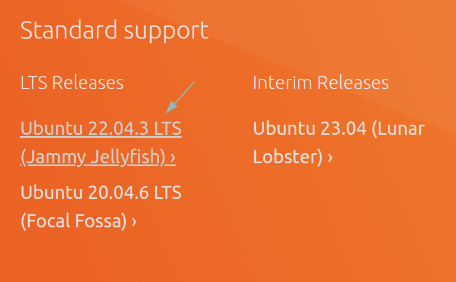

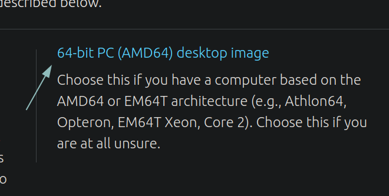

~~**选择仅供参考**~~

## 3.创建虚拟机

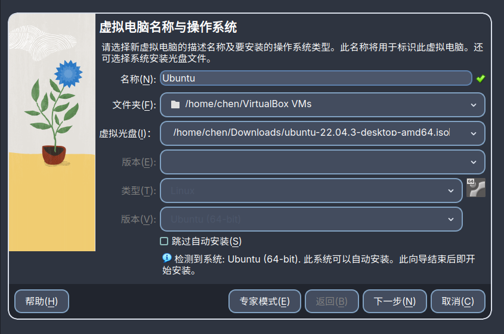

一路下一步

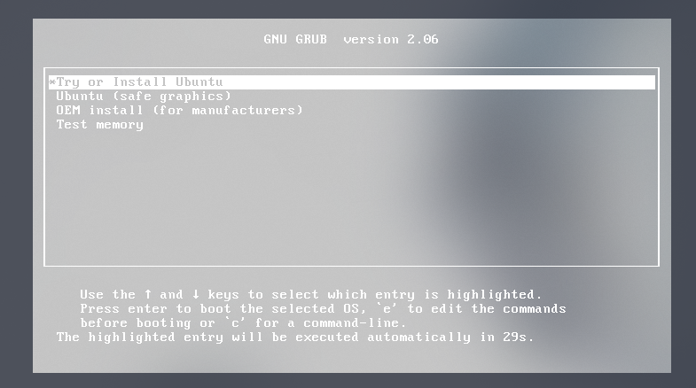

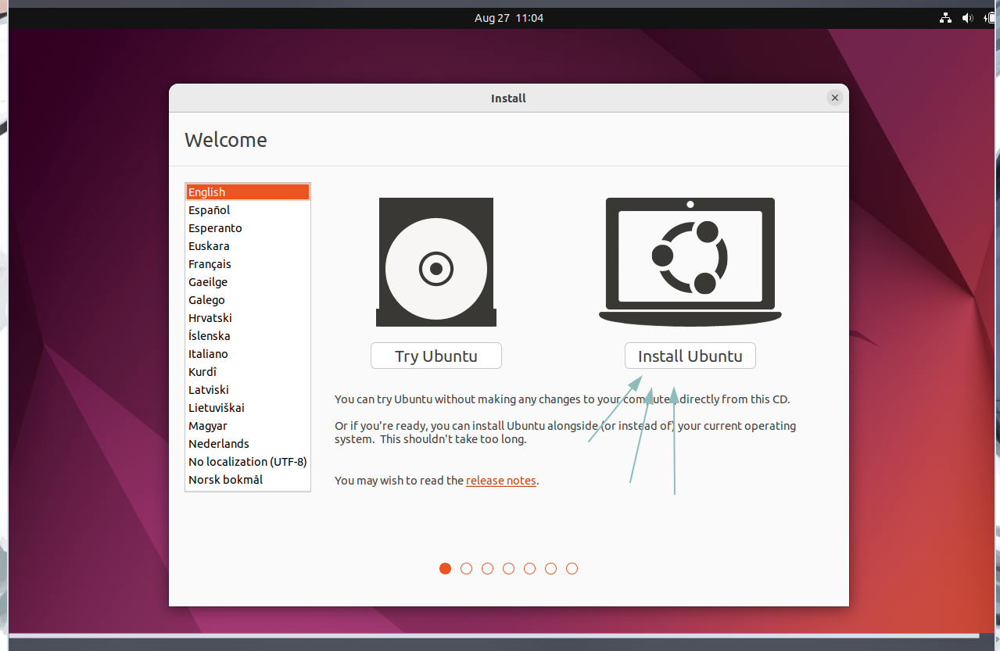

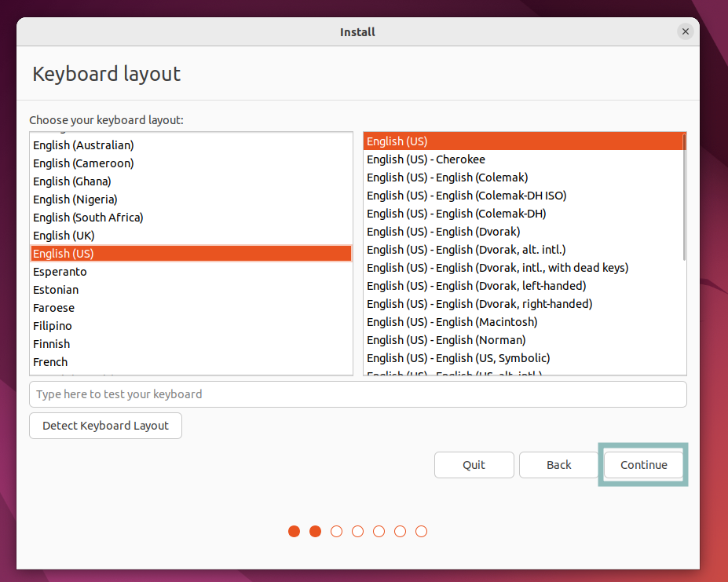

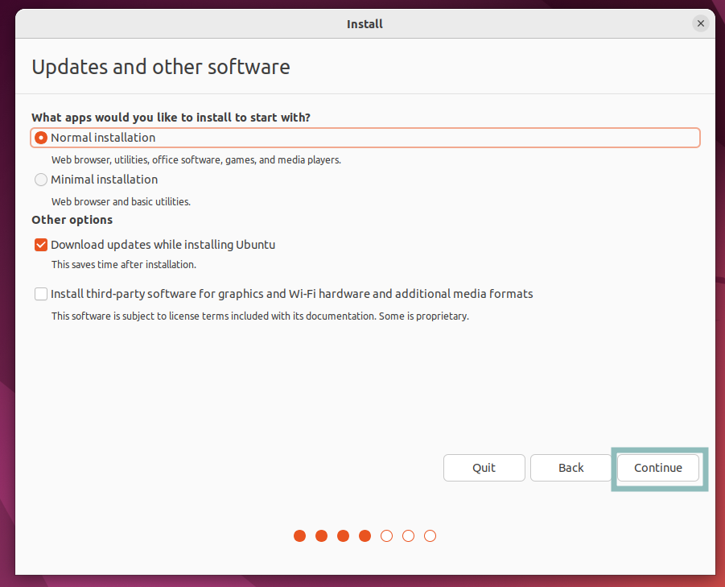

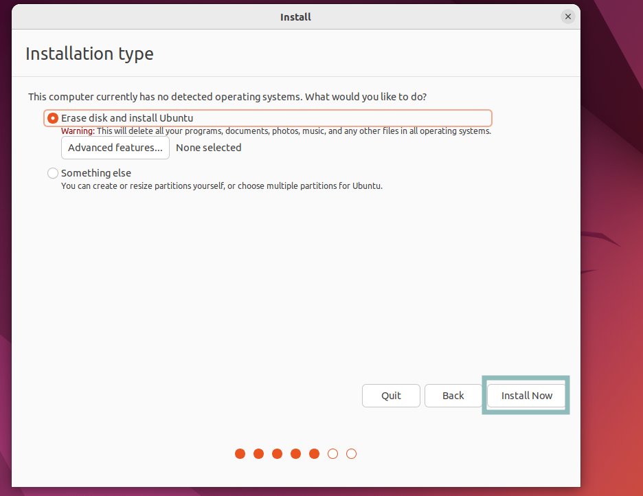

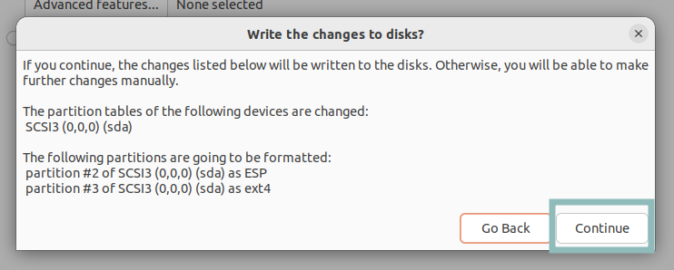

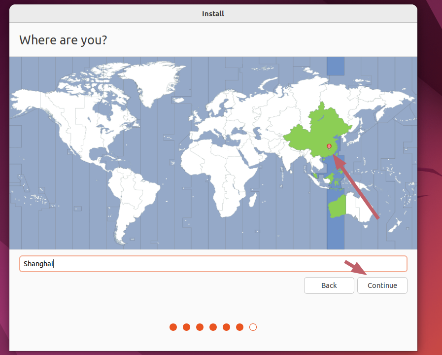

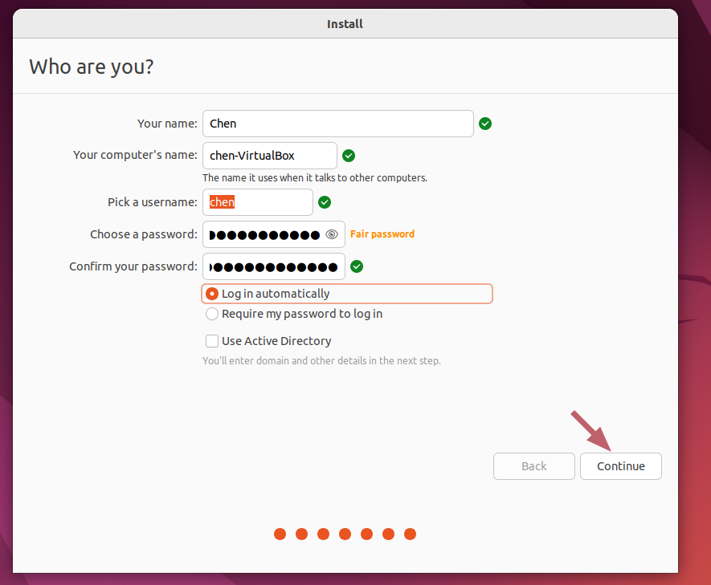

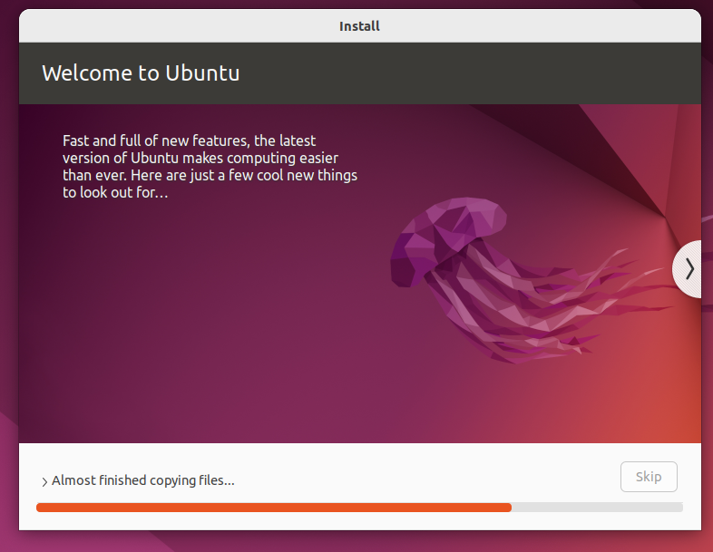

喝杯咖啡

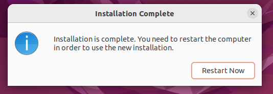

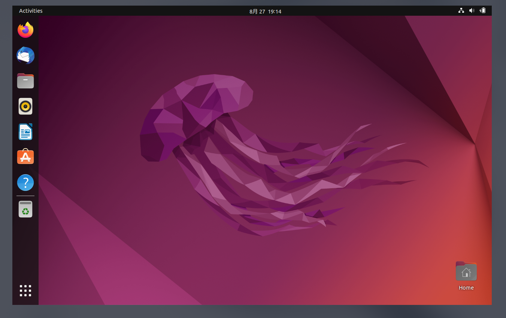
