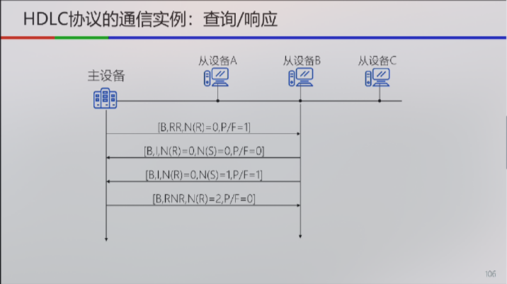
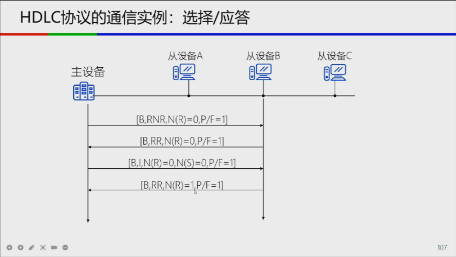
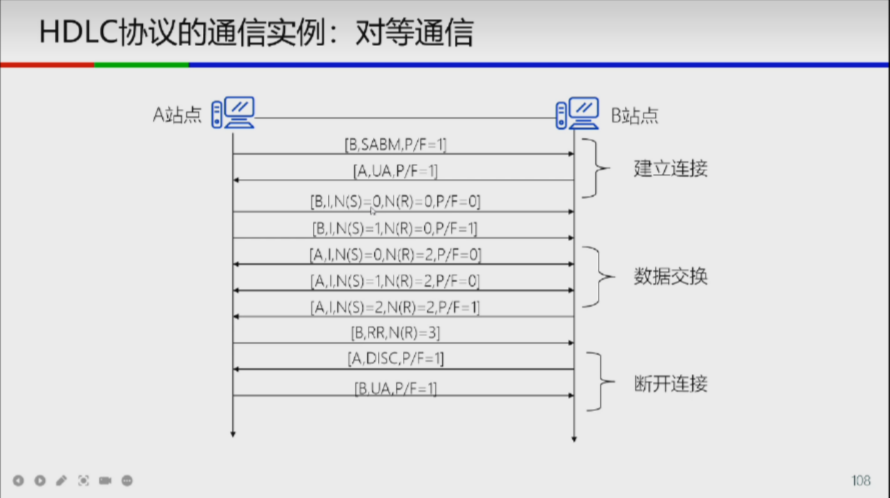

# HDLC

## Frame Format

| Flag     | Address      | Control  | Information          | FCS       | Flag     |
| -------- | ------------ | -------- | -------------------- | --------- | -------- |
| 01111110 | 1/more bytes | 8/16bits | variable, 8 x n bits | 16/32bits | 01111110 |

## Flag Sequence

Use the flag sequence `01111110` to delimit frames.

If the flag sequence appears in the data, it is escaped by inserting a `0` after five consecutive `1`s.

## Address Field

- all bits are `1` for broadcast
- can have multicast addresses.

For address field longer than 1 byte, the last byte has the last bit set to `1`,
and the previous bytes have the last bit set to `0`.

## Control Field

The control field is used to specify the type of frame.

- `I` for **I**nformation frames, identified by first bit `0`
- `S` for **S**upervisory frames, identified by first two bits `10`
- `U` for **U**nnumbered frames, identified by first two bits `11`

### Information Frames

|        | 0   | N(S) | P/F | N(R) |
| ------ | --- | ---- | --- | ---- |
| bit(s) | 1   | 3    | 1   | 3    |

- `N(S)` is the send sequence number
- `P/F` is the poll/final bit
- `N(R)` is the receive sequence number

### Supervisory Frames

|        | 10  | CODE | P/F | N(R) |
| ------ | --- | ---- | --- | ---- |
| bit(s) | 2   | 2    | 1   | 3    |

- `CODE` is the command/response code
  - 00: RR (Receive Ready)
  - 01: RNR (Receive Not Ready)
  - 10: REJ (Reject)
  - 11: SREJ (Selective Reject)
- `P/F` is the poll/final bit
- `N(R)` is the receive sequence number

here are some cases of supervisory frames:

```
ACK:  RR | RNR(N(R)=x) | I
REJ:  REJ(N(R)=x) | SREJ(N(R)=x) | I

POLL:     RR(P/F=1)
POLL.ACK: I
POLL.NAK: RR(P/F=1)

SEL:      RNR(P/F=1)
SEL.ACK:  RR(P/F=1)
SEL.NAK:  RNR(P/F=1)
```

### Unnumbered Frames

|        | 11  | CODE | P/F | CODE |
| ------ | --- | ---- | --- | ---- |
| bit(s) | 2   | 2    | 1   | 3    |

- 5-bit `CODE` field, can represent up to 32 commands.
- P/F bit is set to `1` in most cases.

## Information Field

- In an information frame, the information field contains the data to be transmitted.
- In a supervisory frame, the information field is empty.
- In an unnumbered frame, the information field contains information about the link.

HDLC uses **piggybacking** to send data and control information in the same frame, which is more efficient.

## Frame Check Sequence (FCS)

- Use CRC to check the integrity of the frame.
- CRC-CCITT (X^16 + X^12 + X^5 + 1) is commonly used.

## Example






