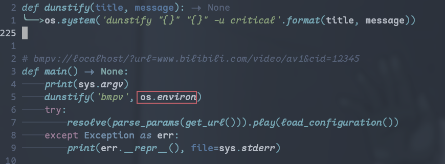
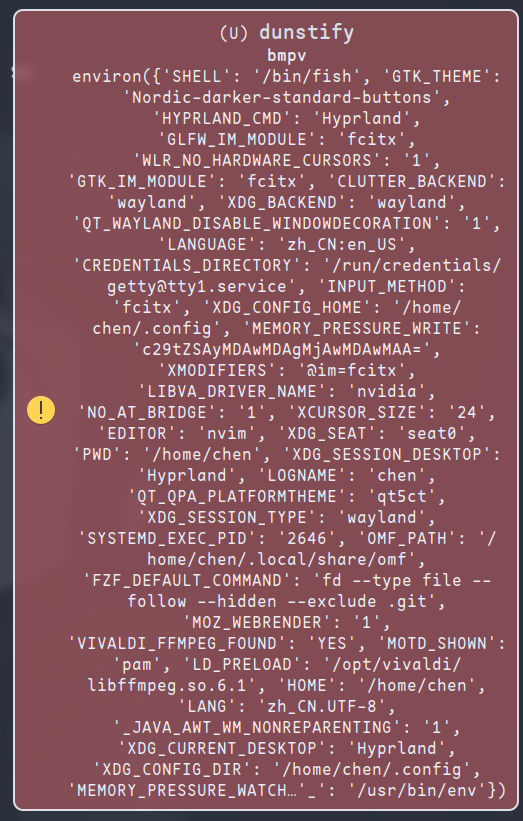
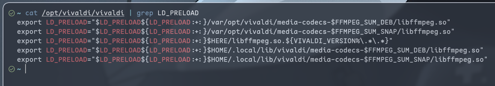

# LD_PRELOAD导致的mpv崩溃

前些天写了一个[脚本](https://github.com/CrackTC/bmpv)，用`mpv`播放bilibili的视频，该脚本在Firefox下工作良好，但是在vivaldi下却啥反应也没有

最开始怀疑是`xwayland`下启动`mpv`的问题，但是通过设置`GDK_BACKEND=x11`等等一堆环境变量依然无法解决

依然怀疑是`xwayland`的问题，尝试打印bmpv的环境变量





```python
'LDPRELOAD': '/opt/vivaldi/libffmpeg.so.6.1'
```

发现存在`LD_PRELOAD`，使得`mpv`链接到了vivaldi的`libffmpeg.so.6.1`，从而导致崩溃

追根溯源找到`/opt/vivaldi/vivaldi`，发现vivaldi果然在启动时设置了`LD_PRELOAD`



解决方法是在`bmpv.desktop`中设置`LD_PRELOAD`为空

```bash
Exec=env LD_PRELOAD= bmpv %U
```
