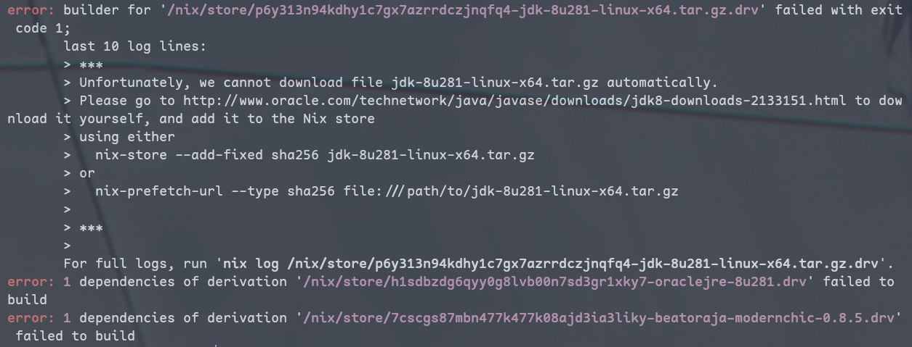
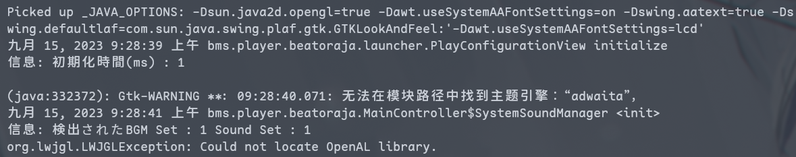
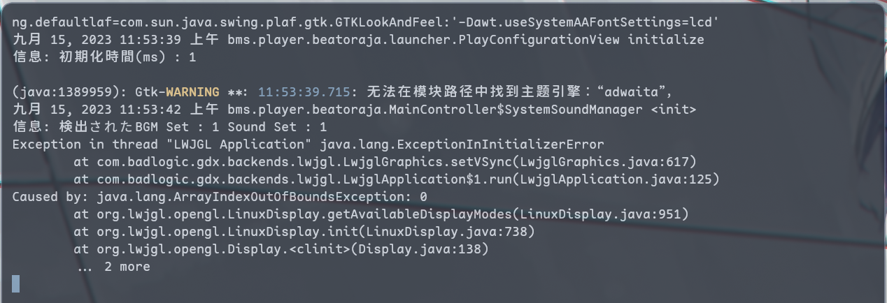
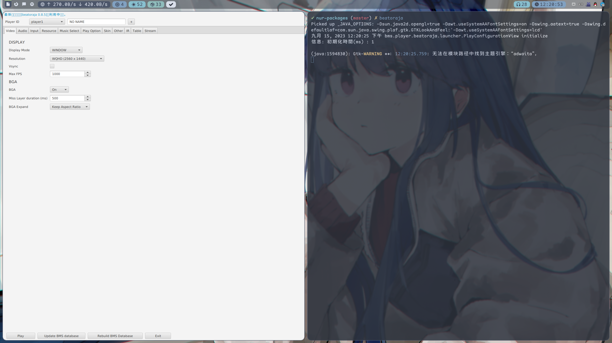

# Nix打包初探（以beatoraja为例）

## Prolog

这两天从ArchLinux转到了NixOS，一开始只是简单的尝试，结果体验了一回Nix配置管理的强大之后就再也回不去，索性作为主力系统使用了。（Declarative大法好～）

常见的软件都能在nixpkgs里找到，但是不幸常玩的beatoraja不在其列，咱又不能想玩的时候再切回Arch，于是参考了一些教程，自己动手尝试打包了一下。

## 大致情况

首先，beatoraja依赖于Java 8，有两种选择，一种是使用OpenJDK，额外需要编译一个OpenJFX，而这玩意在NixOS下的编译花了一天也没整明白，只得退而选择unfree但自带JFX的OracleJDK。

## 具体步骤

以下步骤很大程度学习了这篇[大佬的文章](https://lantian.pub/article/modify-computer/nixos-packaging.lantian/)，讲的超级好QwQ

### 0. 创建自己的包仓库

这里直接使用了[NUR的模板](https://github.com/nix-community/nur-packages-template)进行创建，完了之后在`flake.nix`里添加下面内容

```nix
{
  inputs.myRepo = {
    url = "github:CrackTC/nur-packages"; # 替换为自己的仓库地址
    inputs.nixpkgs.follows = "nixpkgs";
  };

  outputs = { nixpkgs, ... } @inputs:
    let
      pkgs = import inputs.nixpkgs {
        inherit system;
        config.allowUnfree = true;
      };

      # ...

      myRepo = import inputs.myRepo { inherit pkgs; }; # oraclejdk需要allowUnfree
      extraRepos = {
        inherit myRepo;
      };
    in
    {
      nixosConfigurations.cno = {
        specialArgs = { inherit pkgs extraRepos; };
        modules = [ ... ];
      };
    };
}
```

这样`modules`里就可以像下面这样使用自己的仓库里的包啦

```nix
{ extraRepos, ... }: {
  environment.systemPackages = with extraRepos; [ myRepo.beatoraja ];
}
```

### 1. 创建包

照着模板给的`example-package`，在`pkgs`目录下创建`beatoraja`目录，然后创建`default.nix`，内容如下

```nix
{ stdenv
}:

let
  pname = "beatoraja-modernchic";
  version = "0.8.5";
  fullName = "beatoraja${version}-modernchic";
in
stdenv.mkDerivation rec {
  inherit pname version;
  name = "${pname}-${version}";
}
```

这里的输入参数会由`callPackage`根据`pkgs`自动填充

### 2. 获取文件

beatoraja的zip文件可以通过`https://mocha-repository.info/download/<fullName>.zip`获取，其中`<fullName>`就是上面`default.nix`里的`fullName`格式，所以我们需要在`default.nix`里添加`src`属性，以及额外用到`fetchurl`进行下载

```nix
{ stdenv
, fetchurl
}:

let
  # ...
in
stdenv.mkDerivation rec {
  # ...
  src = fetchurl {
    url = "https://mocha-repository.info/download/${fullName}.zip";
    sha256 = "..."; # 可以先不填，后面根据报错给的实际值填上
  };
}
```

### 3. 打包之Unpack Phase

这里需要用到`unzip`，在`buildInputs`里添加以获取对`unzip`包的引用，`unpackPhase`的内容是这一阶段执行的shell命令，在`nativeBuildInputs`中添加`unzip`后就能直接在`unpackPhase`中使用对应的命令。

```nix
{ stdenv
# ...
, unzip
}:

let
  # ...
in
stdenv.mkDerivation rec {
  # ...

  nativeBuildInputs = [ unzip ];
  unpackPhase = "unzip $src"; # $src对应获取到的文件
}
```

### 4. 打包之Install Phase

因为直接获取到了JAR包，所以这里直接跳过了`patchPhase`、`configurePhase`和`buildPhase`，当然也不会有`checkPhase`，咱只需要进行安装以及安装前的准备

#### 4.1 安装前准备

这里主要对原有的启动脚本进行一些修改。一方面由于NixOS不遵循FHS，`java`这类命令自然不能直接用；另一方面，为了保证不变性，输出目录`/nix/store`是只读的，于是相关的数据文件和目录需要放到`$XDG_DATA_HOME`下边。

在这一步需要知道`java`在哪，引入`oraclejre8`依赖以获取输出路径

```nix
{ stdenv
# ...
, oraclejre8}:

let
  # ...
in
stdenv.mkDerivation rec {
  # ...

  preInstall = ''
    rm ${fullName}/beatoraja-config.* # 删除原有的启动脚本
    echo "#!/bin/sh" > ${fullName}/beatoraja.sh # 重新创建启动脚本

    echo 'if [ ! -d "''${XDG_DATA_HOME:-$HOME/.local/share}/beatoraja" ]; then' >> ${fullName}/beatoraja.sh # 如果不存在beatoraja的数据目录

    echo 'mkdir -p "''${XDG_DATA_HOME:-$HOME/.local/share}/beatoraja"'          >> ${fullName}/beatoraja.sh # 创建数据目录
    echo 'cd "''${XDG_DATA_HOME:-$HOME/.local/share}/beatoraja"'                >> ${fullName}/beatoraja.sh # 进入数据目录

    # 复制相关文件
    echo "cp -r $out/share/beatoraja/bgm ./"          >> ${fullName}/beatoraja.sh
    echo "cp -r $out/share/beatoraja/defaultsound ./" >> ${fullName}/beatoraja.sh
    echo "cp -r $out/share/beatoraja/folder ./"       >> ${fullName}/beatoraja.sh
    echo "cp -r $out/share/beatoraja/ir ./"           >> ${fullName}/beatoraja.sh
    echo "cp -r $out/share/beatoraja/skin ./"         >> ${fullName}/beatoraja.sh
    echo "cp -r $out/share/beatoraja/sound ./"        >> ${fullName}/beatoraja.sh
    echo "cp -r $out/share/beatoraja/table ./"        >> ${fullName}/beatoraja.sh

    # 修改权限
    echo "find . -type d -exec chmod 755 {} \;"       >> ${fullName}/beatoraja.sh
    echo "find . -type f -exec chmod 644 {} \;"       >> ${fullName}/beatoraja.sh

    echo "fi" >> ${fullName}/beatoraja.sh

    echo 'cd "''${XDG_DATA_HOME:-$HOME/.local/share}/beatoraja"' >> ${fullName}/beatoraja.sh # 确保每次执行的工作目录

    # 这里通过内联oraclejre8能够直接获取到其在/nix/store中的路径
    echo "exec ${oraclejre8}/bin/java -Xms1g -Xmx4g -jar '$out/share/beatoraja/beatoraja.jar'" >> ${fullName}/beatoraja.sh
    chmod +x ${fullName}/beatoraja.sh # 赋予执行权限
  ''
}
```

#### 4.2 安装

这里将`beatoraja.sh`移动到`$out/bin`下，其余文件移动到`$out/share/beatoraja`下，其中`$out`是`stdenv.mkDerivation`的输出目录，也就是`/nix/store`下的包目录，这样就能够在`$PATH`中找到启动脚本了。

还需要对启动脚本进行一些包装，以便于在启动时添加一些参数，比如`-Dsun.java2d.opengl=true`，这里使用了`makeWrapper`，以便在`installPhase`中使用`wrapProgram`命令

```nix
{ stdenv
# ...
, makeWrapper
}:

let
  # ...
in
stdenv.mkDerivation rec {
  # ...

  nativeBuildInputs = [ ... makeWrapper ];

  installPhase = ''
    runHook preInstall

    mkdir -p $out/share/beatoraja
    mkdir -p $out/bin
    mv ${fullName}/beatoraja.sh $out/bin/beatoraja
    mv ${fullName}/* $out/share/beatoraja

    # prefix: 在原有的环境变量前添加
    wrapProgram $out/bin/beatoraja \
      --prefix _JAVA_OPTIONS : "-Dsun.java2d.opengl=true -Dawt.useSystemAAFontSettings=on -Dswing.aatext=true -Dswing.defaultlaf=com.sun.java.swing.plaf.gtk.GTKLookAndFeel"

    runHook postInstall
  '';
}
```

完成了之后，别忘了在仓库的`default.nix`里添加`beatoraja`的引用～

```nix
{ pkgs ? import <nixpkgs> { } }:

{
  # The `lib`, `modules`, and `overlay` names are special
  lib = import ./lib { inherit pkgs; }; # functions
  modules = import ./modules; # NixOS modules
  overlays = import ./overlays; # nixpkgs overlays

  example-package = pkgs.callPackage ./pkgs/example-package { };
  beatoraja = pkgs.callPackage ./pkgs/beatoraja { };
  # some-qt5-package = pkgs.libsForQt5.callPackage ./pkgs/some-qt5-package { };
  # ...
}
```

### 5. 遇到的问题及解决方案

#### 5.1 无法自动获取`jdk-8u281-linux-x64.tar.gz`



oracle官方的下载链接需要登录并同意一个EULA才能获取，这里手动下载了一个放在了自家服务器上，然后对原来的`oraclejre8`包进行一个`override`，替换掉`src`的内容

```nix
{ stdenv
# ...
, oraclejre8
}:

let
  jre = oraclejre8.overrideAttrs {
    src = fetchTarball {
      url = "https://static.sora.zip/nix/jdk-8u281-linux-x64.tar.gz";
      sha256 = "...";
    };
  };
in
stdenv.mkDerivation {
  # ...

  preInstall = ''
    # ...

    echo "exec ${jre}/bin/java -Xms1g -Xmx4g -jar '$out/share/beatoraja/beatoraja.jar'" >> ${fullName}/beatoraja.sh

    # ...
  '';

  # ...
}
```

#### 5.2 处理依赖



这回能见到配置窗口了，但还是启动不了游戏，原因是找不到`OpenAL`库，准确来说是`libopenal.so`。`OpenAL`可以直接从`nixpkgs`获取，这里直接通过`LD_LIBRARY_PATH`和`LD_PRELOAD`实现动态库的加载。

```nix
{ stdenv
# ...
, openal
}:

let
  # ...
in
stdenv.mkDerivation {
  installPhase = ''
    # ...

    wrapProgram $out/bin/beatoraja \
      --prefix LD_LIBRARY_PATH : "${openal}/lib" \
      --prefix LD_PRELOAD : "${openal}/lib/libopenal.so" \
      # ...

    # ...
  '';
}
```



发现依然启动不了，搜索后找到[这篇回答](https://stackoverflow.com/questions/58939641/lwjgl-crashing-at-startup)。原来`LWJGL`的`getAvailableDisplayModes`函数硬编码了对`xrandr`的调用=_=

差不多的方法，输入参数中添加`xrandr`，`wrapProgram`里添加个`PATH`就行了

```nix
{ stdenv
# ...
, xrandr
}:

let 
  # ...
in
stdenv.mkDerivation {
  installPhase = ''
    # ...

    wrapProgram $out/bin/beatoraja \
      --prefix PATH : "${xrandr}/bin" \
      # ...

    # ...
  '';
}
```

`xrandr`的完整包名是`xorg.xrandr`，输入参数能直接填`xrandr`，可能`callPackage`的名称搜索是递归的（？

### 6. 启动！




## 改善音频延迟（`jportaudio`）

默认使用的`OpenAL`在我的设备上音频延迟很不乐观，对于beatoraja这种key音音游来说相当致命，几乎是不可玩的状态。为了获得更低的音频延迟，beatoraja支持使用`jportaudio`输出，当然这里也是需要咱自己打包的。

`jportaudio`的官方仓库在[这里](https://github.com/philburk/portaudio-java)，由于使用`cmake`进行构建，打包过程简单多了QwQ

按照同样的步骤在`pkg`下创建`libjportaudio`目录，然后创建`default.nix`，内容如下

```nix
{ stdenv
, fetchFromGitHub
, oraclejdk8 # 废话
, cmake      # 使用cmake进行构建
, portaudio  # 依赖libportaudio.so
}:

let
  version = "0.1.0";
  pname = "libjportaudio";
  jdk = oraclejdk8.overrideAttrs {
    src = fetchTarball {
      url = "https://static.sora.zip/nix/jdk-8u281-linux-x64.tar.gz";
      sha256 = "0f9fb37p75cf7qfm67yc8ariqksnw8641kh2zcwvlrr4r8lgj70v";
    };
  };
in
stdenv.mkDerivation rec {
  inherit version pname;
  name = "${pname}-${version}";
  src = fetchFromGitHub ({
    owner = "philburk";
    repo = "portaudio-java";
    rev = "2ec5cc47d6f8abe85ddb09c34e69342bfe72c60b";
    sha256 = "t+Pqtgstd1uJjvD4GKomZHMeSECNLeQJOrz97o+lV2Q=";
  });

  nativeBuildInputs = [ cmake portaudio ];

  preConfigure = ''
    export JAVA_HOME=${jdk}
  '';

  # configurePhase会自动执行cmake

  buildPhase = ''
    make jportaudio_0_1_0
  '';

  installPhase = ''
    mkdir -p $out/lib
    cp libjportaudio_0_1_0.so $out/lib/libjportaudio.so
  '';
}
```

然后在`beatoraja`的`default.nix`里添加`libjportaudio`的引用

```nix
{ stdenv
# ...
, libjportaudio
}:

let
  # ...
in
stdenv.mkDerivation rec {
  # ...

  nativeBuildInputs = [ ... libjportaudio ];

  installPhase = ''
    # ...

    wrapProgram $out/bin/beatoraja \
      --prefix LD_LIBRARY_PATH : "${libjportaudio}/lib" \
      --prefix LD_PRELOAD : "${libjportaudio}/lib/libjportaudio.so" \
      # ...

    # ...
  '';
}
```

注意这里的`libjportaudio`并不在`pkgs`里头，所以`callPackage`的时候得咱自己传进去

```nix
{ pkgs ? import <nixpkgs> { } }:

rec {
  # ...

  beatoraja = pkgs.callPackage ./pkgs/beatoraja { libjportaudio = libjportaudio; }; # 看这里看这里！
  libjportaudio = pkgs.callPackage ./pkgs/libjportaudio { };

  # ...
}
```

之后就可以开始愉快的玩耍啦～

## 遗憾

整个打包过程中，最遗憾的是`OpenJFX`的编译，也不知道是不是姿势不对，但我确实在Java项目的编译上没有任何经验，所以就没有继续尝试了。

另一个遗憾是没有将`jportaudio`作为可选依赖，作为个人仓库就想着咋快咋来了，可能还要再研究一下更加优雅的写法。
