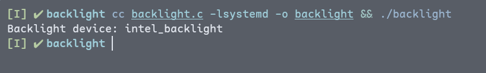
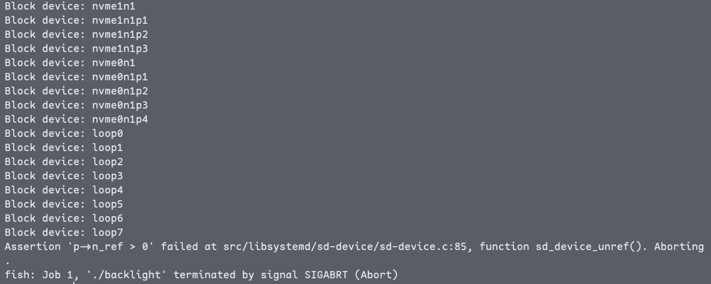
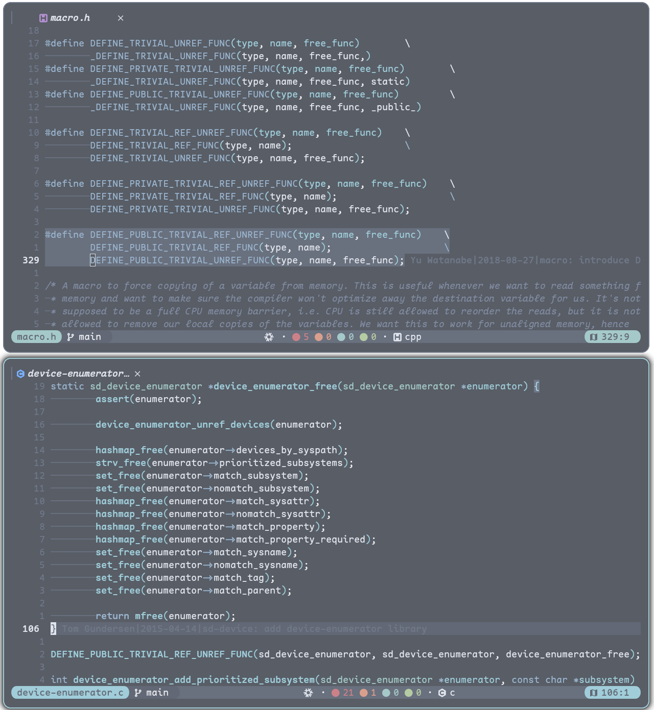
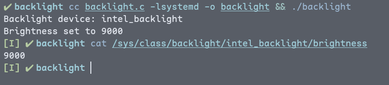

---

`/sys/class/backlight/`下面的背光设备默认好像得 root 权限才能写入，一个常见的解决方案是使用 udev 规则修改文件属组，再把自己加入进去。某天抬头一看，waybar 好像没问我要 root 也能改，気になります！

翻了下 waybar 的 backlight 实现，大概从[这里](https://github.com/Alexays/Waybar/blob/42dc9cb85f27e3db02da83cd13624cfc5a7191d3/src/util/backlight_backend.cpp#L144)开始，使用`udev`枚举了一波 backlight 设备，然后通过一个到`org.freedesktop.login1.Session`的 Proxy 设置亮度，有几个相关的链接：

- [**org.freedesktop.login1**](https://www.freedesktop.org/software/systemd/man/latest/org.freedesktop.login1.html) 暴露了`SetBrightness`方法，支持非特权调节背光
- [**D-Bus Tutorial**](https://dbus.freedesktop.org/doc/dbus-tutorial.html) 一篇关于 D-Bus 的介绍

看了看`libudev`的man page，建议我们使用`sd-device`替代

> libudev.h provides an API to introspect and enumerate devices on the local system. This library is supported, but should not be used in new projects. Please see sd-device(3) for an equivalent replacement with a more modern API.

于是屁颠屁颠地跑去 systemd 那，好心人连 D-Bus client 都给封装好了~~做事是真的多~~

---

nix 人先 copy 一个 devShell 过来

```nix
{
  inputs = {
    nixpkgs.url = "github:NixOS/nixpkgs/nixos-unstable";
    flake-utils.url = "github:numtide/flake-utils";
  };
  outputs = { nixpkgs, flake-utils, ... }:
    flake-utils.lib.eachDefaultSystem (system:
      let pkgs = import nixpkgs { inherit system; };
      in {
        devShells.default = pkgs.mkShell {
          packages = with pkgs; [ systemd.dev ];
        };
      });
}
```

```c
#include <stdio.h>
#include <systemd/sd-device.h>

#define _cleanup_(x) __attribute__((cleanup(x)))

#define SUBSYSTEM "backlight"

int main() {
  _cleanup_(sd_device_enumerator_unrefp) sd_device_enumerator *enumerator =
      NULL;

  int r = sd_device_enumerator_new(&enumerator);
  if (r < 0) {
    fprintf(stderr, "Failed to create device enumerator: %s\n", strerror(-r));
    return 1;
  }

  r = sd_device_enumerator_add_match_subsystem(enumerator, SUBSYSTEM, 1);
  if (r < 0) {
    fprintf(stderr, "Failed to add match subsystem: %s\n", strerror(-r));
    return 1;
  }

  sd_device *backlight = sd_device_enumerator_get_device_first(enumerator);

  if (!backlight) {
    fprintf(stderr, "No backlight device found\n");
    return 1;
  }

  const char *name = NULL;
  r = sd_device_get_sysname(backlight, &name);

  if (r < 0) {
    fprintf(stderr, "Failed to get backlight sysname: %s\n", strerror(-r));
    return 1;
  }

  printf("Backlight device: %s\n", name);

  return 0;
}
```

```shell
cc backlight.c -lsystemd -o backlight && ./backlight
```



`sd_device`比较坏的地方是文档不完整，比如这个`sd_device_enumerator_add_match_subsystem`的第三个参数是啥意思，单看签名真的不懂，翻源码才发现置0排除匹配子系统。还有枚举到的`sd_device`，看stackoverflow上的老哥给的是每次都`sd_device_unref`，如果枚举出来设备不止一个，最后`sd_device_enumerator_unref`就会炸



unref enumerator 的时候应该也会 unref 里面的 device，这里再吐槽下这个 macro，萌新看不懂啦



---

回到正题，拿到`name`了之后就可以丢给 D-Bus 了

```c
#include <stdio.h>
#include <systemd/sd-bus.h>

#define _cleanup_(x) __attribute__((cleanup(x)))

#define SUBSYSTEM "backlight"
#define DESTINATION "org.freedesktop.login1"
#define PATH "/org/freedesktop/login1/session/self"
#define INTERFACE "org.freedesktop.login1.Session"
#define METHOD "SetBrightness"

void set_brightness(const char *name, uint brightness) {
  _cleanup_(sd_bus_error_free) sd_bus_error error = SD_BUS_ERROR_NULL;
  _cleanup_(sd_bus_unrefp) sd_bus *bus = NULL;

  int r;

  r = sd_bus_open_system(&bus);
  if (r < 0) {
    fprintf(stderr, "Failed to connect to system bus: %s\n", strerror(-r));
    return;
  }

  r = sd_bus_call_method(bus, DESTINATION, PATH, INTERFACE, METHOD, &error,
                         NULL, "ssu", SUBSYSTEM, name, brightness);
  if (r < 0) {
    fprintf(stderr, "Failed to set brightness: %s\n", error.message);
    return;
  }

  printf("Brightness set to %u\n", brightness);
}
```

`DESTINATION` 相当于一个 D-Bus 端点，通过 `PATH` 获取到 object，比如这里的`/org/freedesktop/login1/session/self`获取到的是对应当前 systemd session 的 object，实现了`org.freedesktop.login1.Session`接口，可以调用`SetBrightness`方法，参数签名为`ssu`，也就是`string` `string` `unsigned`，`sd_bus_call_method`传进去那个`NULL`代表不接收返回值。按理说`INTERFACE`为了兼容 DCOP，是可以不显式指定的，`sd-bus`这里试了下会报错

实际写的时候用`busctl`进行了一个`list` `tree` `introspect` 防呆三板斧



搞定～

---

顺带一提获取背光亮度这种属性可以用`sd_device_get_sysattr_value`，如果要 watch 的话可以用`sd_device_monitor` （防止自己忘了.jpg）
