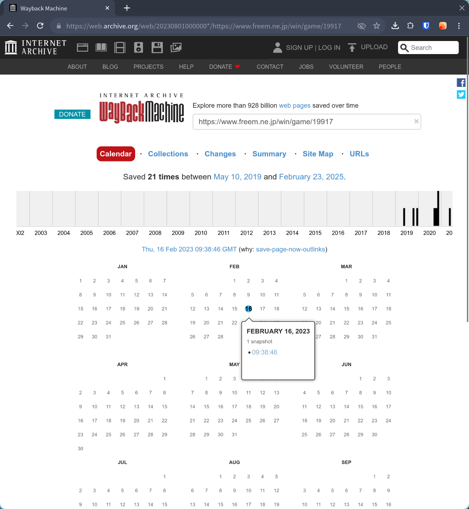
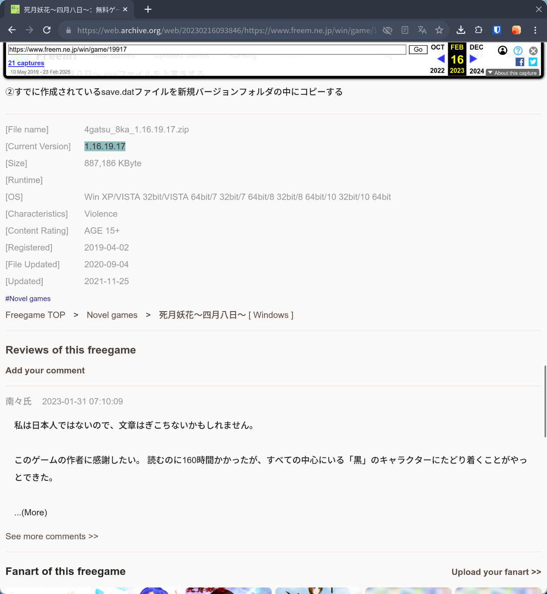
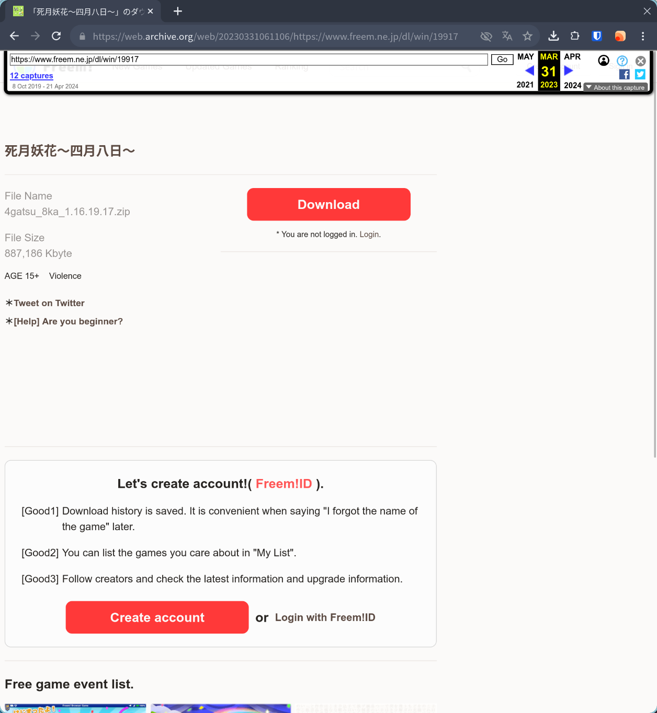
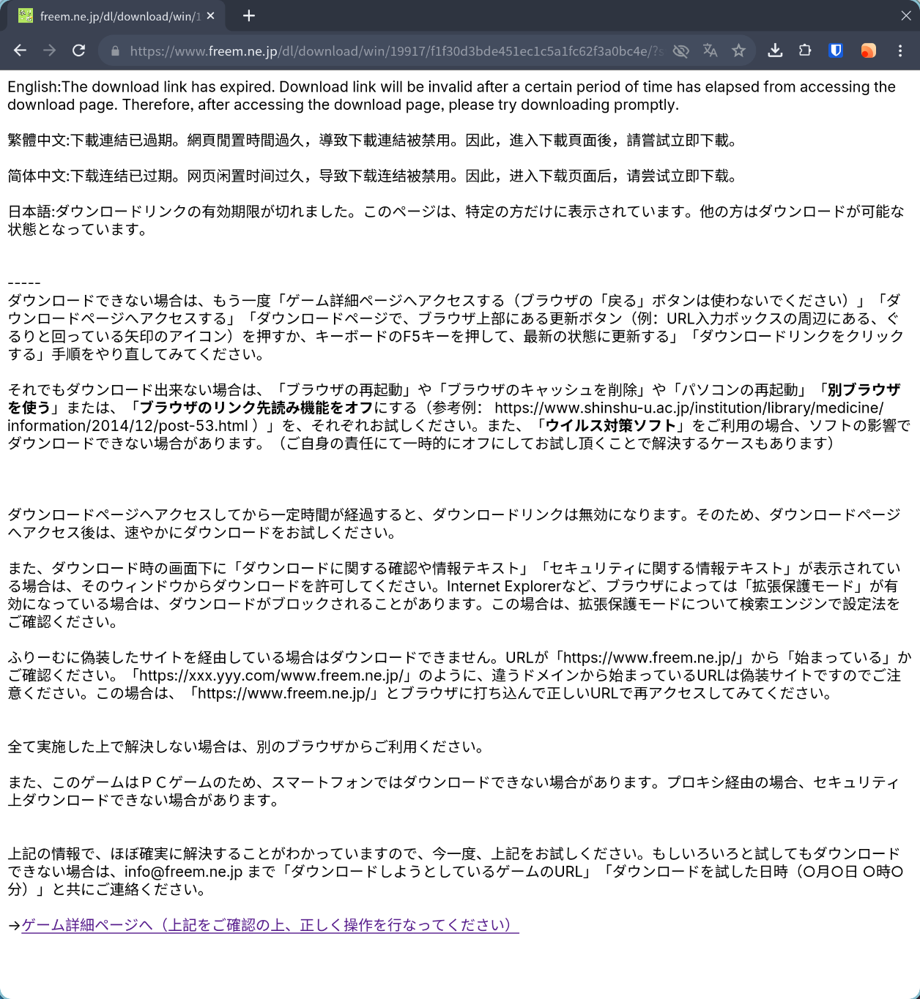
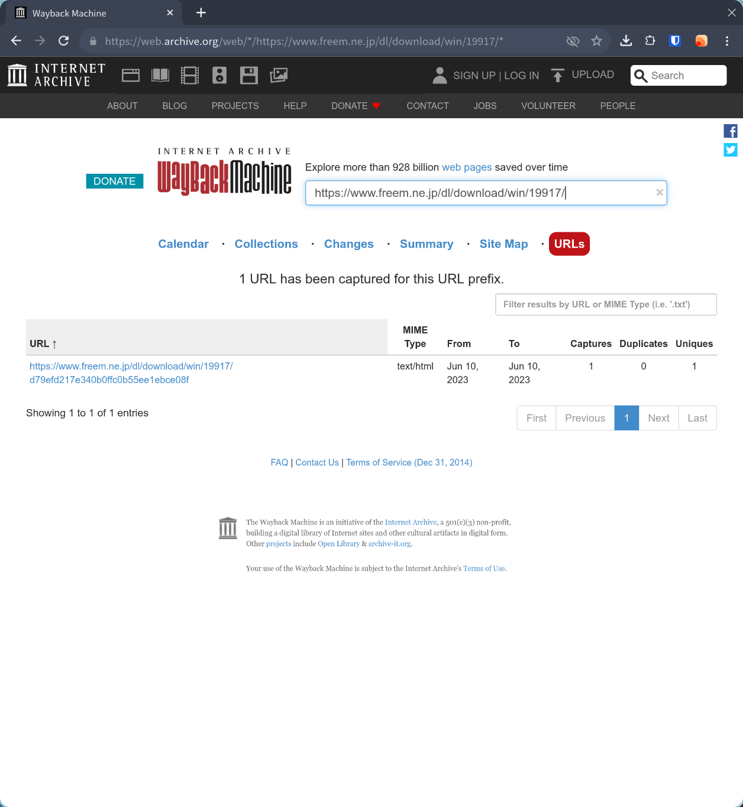
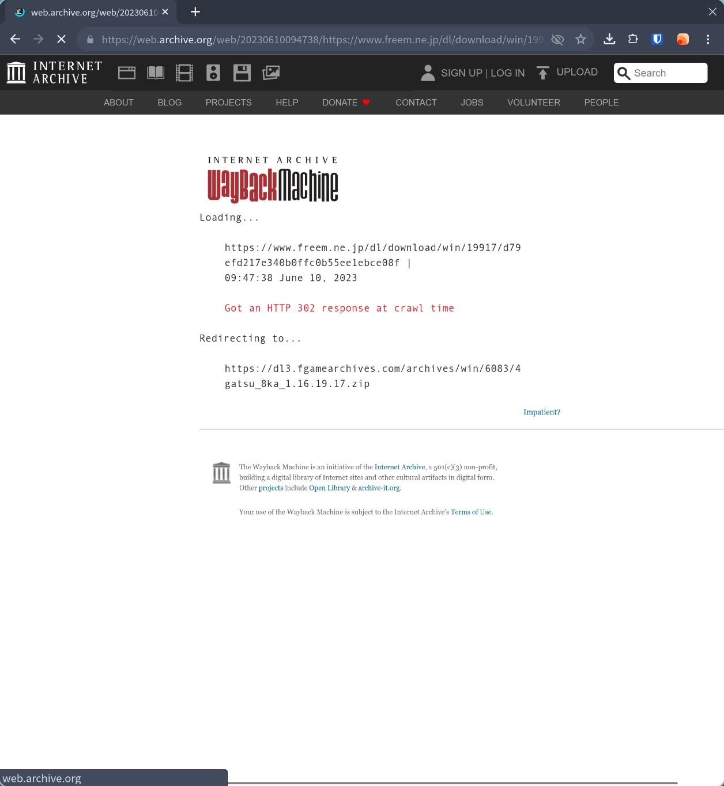
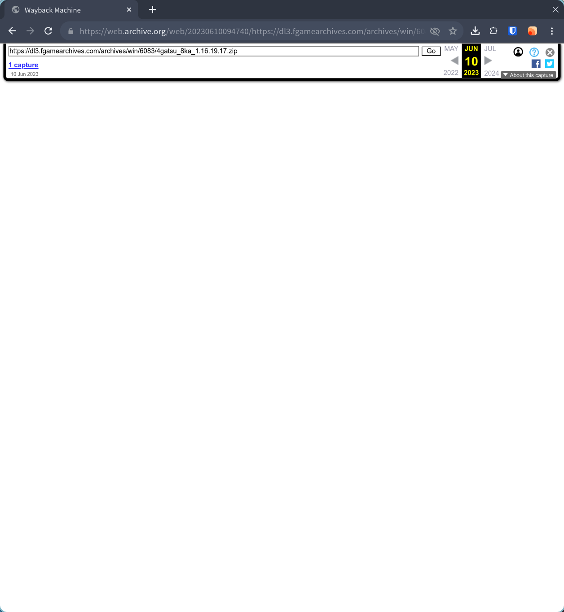

# Wayback Machine 使用笔记 - 死月妖花 1.16 版本下载

因为商业化上的一些原因，死月妖花在 2024 年 4 月 8 日更新了 2.0 版本，并在其中删除了部分[现实相关的背景设定](https://web.archive.org/web/20250408031901/https://bgm.tv/blog/342664)。而作为游戏发布渠道的 freem 并不提供旧版 1.16.19.17 的下载途径，于是决定去 Wayback Machine 碰碰运气。

直接在 Wayback Machine 搜索游戏发布页地址 https://www.freem.ne.jp/win/game/19917 可以得到下面的结果：



这里选择 23 年 2 月 16 日的快照，可以看到版本号为 1.16.19.17



点击 Download 下的 Windows 按钮后，进入下载页面：



这时再点击 Download 按钮，会发现跳转回到了 freem 的下载页面，当然会提示链接失效：



```
https://www.freem.ne.jp/dl/download/win/19917/f1f30d3bde451ec1c5a1fc62f3a0bc4e
```

把这个网址复制下来，粘贴到 Wayback Machine 的搜索框中也找不到结果。

注意到链接的组成，19917 为游戏 ID ，猜测最后一部分为资源 ID ，尝试使用通配符搜索

```
https://www.freem.ne.jp/dl/download/win/19917/*
```



可以看到有 2023 年 7 月 10 日的快照，点击进去：



会进行一个重定向，之后便能开始下载


