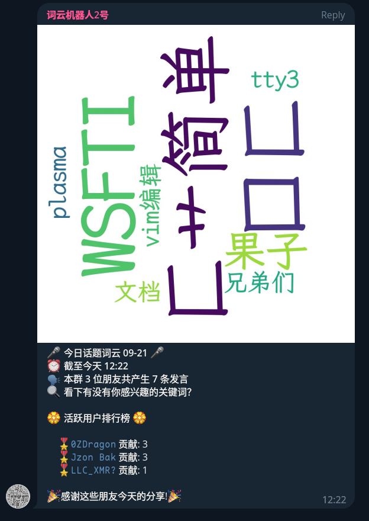

# 轮椅之Q群词云机器人

在tg群里看到一个每日词云的bot，心血来潮在qq上实现了下

~~类似这种↓~~



过程很顺利，词云生成（[`word_cloud`](https://github.com/amueller/word_cloud)），中文分词（[`jieba`](https://github.com/fxsjy/jieba)），群消息上报和发送（[`go-cqhttp`](https://github.com/Mrs4s/go-cqhttp)）都有好用的轮子

选用[`Deno`](https://deno.com)搭建服务器~~浅尝了下类型体操~~

---

首先是群消息的处理，为了绕过CQ码的解析，在`go-cqhttp`的配置中使用`array`作为消息类型

> [`go-cqhttp`中的消息类型](https://docs.go-cqhttp.org/reference/#%E6%B6%88%E6%81%AF)

我们期望的消息格式长这样

```json
{
  post_type: "message" | "message_sent", // 他人发送或自身发送消息
  message_type: "group",                 // 群聊消息
  sub_type: "normal",                    // 普通消息
  group_id: xxxxxxxxxx,                  // 群号
  sender: {
    card: "xxxx" | "",                   // 群昵称，优先采用
    nickname: "xxxx"                     // 昵称，群昵称为空时采用
  },
  message: [
    {
      type: "text",                      // 只处理文本内容
      data: "xxxxxx",                    // 消息文本
    },
    // ...
  ]
}
```

> [`go-cqhttp`中的群消息格式](https://docs.go-cqhttp.org/event/#%E7%BE%A4%E6%B6%88%E6%81%AF)

上报请求的处理

```typescript
const handler = async (request: Request) => {
  const json = await request.json();

  if (msgPredicate(json)) {
    console.log(JSON.stringify(json));
    const group_id: number = json.group_id;
    const nickname: string = json.sender.card != "" // 处理优先级
      ? json.sender.card
      : json.sender.nickname;
    const user_rank = context[group_id].user_rank;
    const messages = context[group_id].messages;

    if (nickname in user_rank) user_rank[nickname]++;
    else user_rank[nickname] = 1;

    json.message.forEach(
      (element: { type: string; data: { text: string } }) => {
        console.log(JSON.stringify(element));
        if (element.type == "text") messages.push(element.data.text);
      },
    );
  }
  return new Response(null, { status: 204 }); // 204表示不进行任何快速反应
};
```

其中`msgPredicate`的具体定义如下，基本就是对上边期望数据的筛选

```typescript
const msgPredicate = (
  json: {
    post_type: string;
    message_type?: string;
    sub_type?: string;
    group_id?: number;
  },
) =>
  (json.post_type == "message" || json.post_type == "message_sent") &&
  json.message_type == "group" &&
  json.sub_type == "normal" && config.groups.includes(json.group_id ?? 0);
```

---

对于定时生成词云使用了[`deno_cron`](https://github.com/rbrahul/deno_cron)，解析配置中的cron表达式并调用处理函数

```typescript
cron(config.cron, () => { /* ... */ });
```

接着拼接同一个群聊所有消息，启动子进程生成图片

```typescript
const all_msg = ctx.messages.join("\n");

// proc = exec("python3 ./word_cloud.py")
// proc.stdin: redirected
// all_msg: write to stdin
```

`word_cloud.py`调用`jieba.cut`分词，统计词频后使用`WordCloud.generate_from_frequencies`生成图片并`to_file`到`./result.png`

这里使用base64通过CQ码发送图片，请求长这样

```json
// POST /send_group_msg
{
  group_id: xxxx,
  message: "[CQ:image,file=base64://...]"
}
```

图片转b64用了`Deno`的标准库

```typescript
import { encode } from "https://deno.land/std@0.202.0/encoding/base64.ts";

function get_image_cqcode(path: string) {
  const base64 = encode(Deno.readFileSync(path));
  return `[CQ:image,file=base64://${base64}]`;
}
```

---

发言排行处理

```typescript
function get_description(ctx: { user_rank: { [nickname: string]: number } }) {
  console.log(JSON.stringify(ctx));
  const entries = Object.entries(ctx.user_rank);
  const people_count = entries.length;
  const msg_count = entries.map(([_, count]) => count).reduce(
    (prev, cur) => prev + cur,
    0,
  );
  entries.sort(([_, count_a], [__, count_b]) => count_b - count_a);
  const rank = entries.length <= 10 ? entries : entries.slice(0, 10);
  return `本群 ${people_count} 位朋友共产生 ${msg_count} 条发言\n活跃用户排行榜\n${
    rank.map(([name, count]) => `${name} 贡献: ${count}`).join("\n")
  }`;
}
```

请求格式

```json
// POST /send_group_msg
{
  group_id: xxxx,
  message: "xxxx",
  auto_escape: true // 防止奇奇怪怪的昵称被解析成CQ码
}
```

---

项目地址：[CrackTC/qwordcloud](https://github.com/CrackTC/qwordcloud)

冲着能用写的，代码不好看诶嘿～
